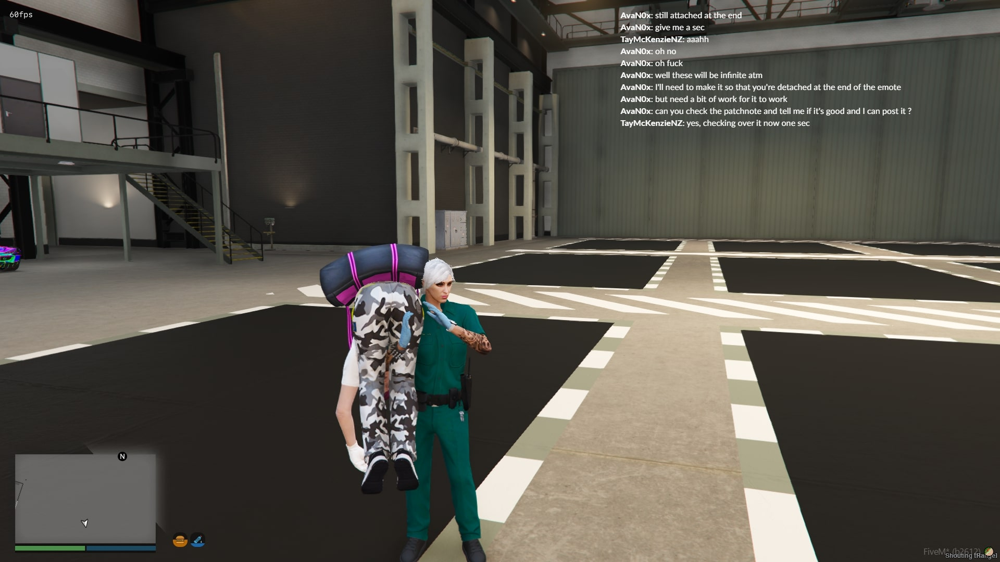
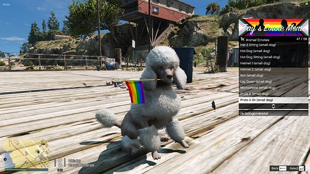
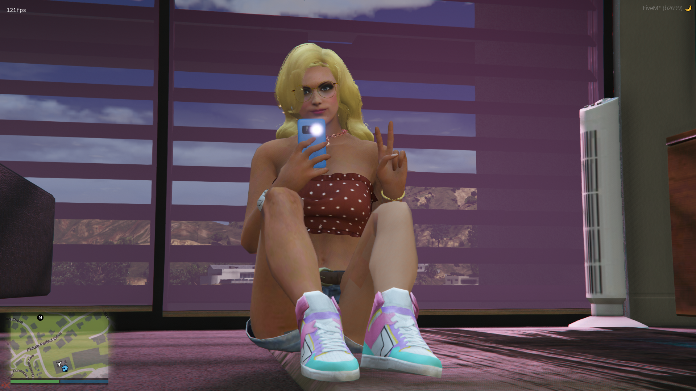
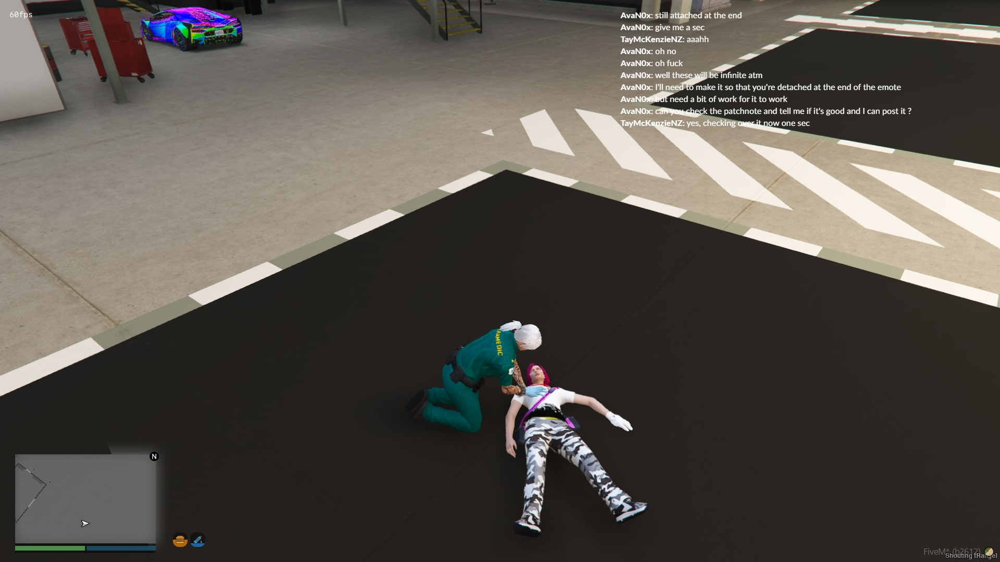
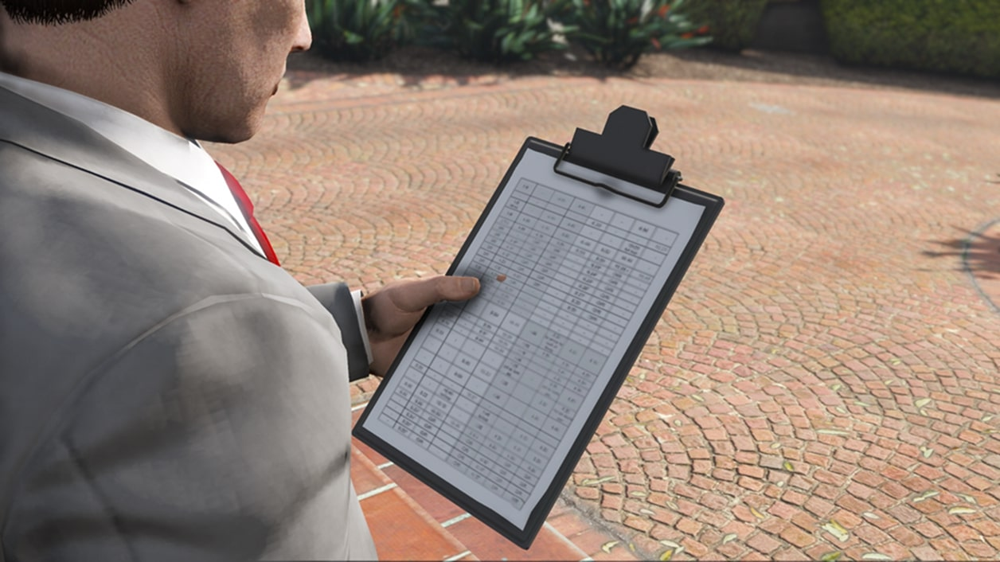
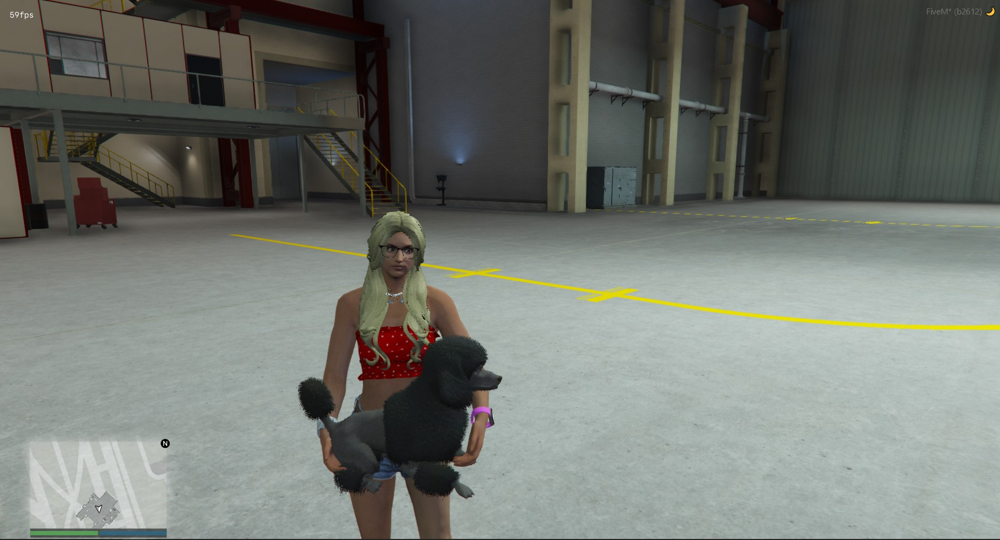

# DpEmotes 🏋️

Community driven FiveM emote menu with human, animal and prop support 🐩


# **Join Our Official Discord 💬:**

<a href="https://discord.gg/sw3NwDq6C8" target="blank"></a>

- Report Issues ⚠️

- Report Bugs 🪲

- Contribute Code 🛠️

- Contribute Translations 🌏

- Chat With Me 🗨️

-----------------------------------


# Available in:

* Brazilian Portuguese 🇧🇷

* Czech 🇨🇿

* Danish 🇩🇰

* Dutch 🇳🇱

* English 🇬🇧

* Finnish 🇫🇮

* French 🇫🇷

* German 🇩🇪

* Italian 🇮🇹

* Polish 🇵🇱

* Romanian 🇷🇴

* Spanish 🇪🇸

* Swedish 🇸🇪

All languages were either translated using Google Translate or contributed by you, the community. 

If you happen to find any incorrect translations or would like to add more languages, please feel free to provide an "issue" with the correct / additional translations.

Languages can be selected and/or added in config.lua.

-----------------------------------------------------------------------------------------------------------------------------------------------------------------------

# Features

- Search Function 🔎

- Custom Animations 🏃

- Further support for shared and couple poses / animations 👫

- Animal Emotes - Big dog and small dog. *More to come. Stay tuned!* 🐩

* Easily convert Menyoo to dpemotes 🔄

- Shared Dances 🕺💃

- Shared Particle Effects 💨

- QBCore Framework & Keybinding Support ⚙️

- Hide Adult Emotes 🔞

- Hide Animal Emotes ⛔

- Easy To Understand Configuration File ⚙️

------------------------------------------------------------

# Menu Keybind 🎛️

**Important Note:**

The keybind uses RegisterKeyMapping. By default, the server owner configured keybind in the *initial* config.lua will be the default key, however once the keybind is set for a user, it'll stay with this new value. Editing the config keybind will change it for new players only.


**Menu key:** F5

Server owners can change this in the `config.lua`.

Alternatively, the player base can set their own menu keybind to open DpEmotes

Esc > settings > keybinds > fivem > dpemotes

* More keybinds are now using key mappings which means that they are now available in your FiveM settings to change (`FavKeybind` and `RagdollKeybind`)

-----------------------------------------------------------------------------------------------------------------------------------------------------------------------

# Keybinds and SQL 🎛️

The original dpemotes uses mysql-async which was then changed to ghmattimysql. Unfortunately, they are no longer maintained. 

To use the SQL features, install the [oxmysql](https://github.com/overextended/oxmysql) resource. If you do not want to use the SQL features, comment out the `oxmysql` region in fxmanifest.lua.

Alternatively, you can use the keybind command that comes with FiveM without having the SQL, by entering the following into F8: 

`bind keyboard "Yourbutton" "e youremote"`. To remove the keybind, type `"unbind keyboard "Yourbutton"`.

-------------------------------------------------

# Ragdoll 🥴

* To enable ragdoll, change `RagdollEnabled = false,` to true in config.lua.

Much like the menu key, `RagdollKeybind` is also using RegisterKeyMapping. It is currently set to `U` by default *(server side)* however can be set to the player's preferred keybind in the FiveM keybinds setting found in the settings menu within the Esc Menu.

* New setting: `RagdollAsToggle`, this will make either the ragdoll be a toggle or a hold key

----------------------------------------------------------------------------------------------------------------------------------------------------------------------------------------------------------------------------------------------------------------------------------------------------------------------------------------------

# Adult Emotes 🔞

Adult Emotes can be hidden from the menu by setting `AdultEmotesDisabled` to `true` in the config.lua file.

This will completely conceal the emotes from the lists *(Emotes, Shared Emotes, etc)* at startup making them unusable.

The emotes that are concealed, are the ones flagged in the animation list with `AdultAnimation`. You can see how it is done with `fspose`.

Alternatively, you can also hide animal emotes.
------------------------------------------------------------------------------

# QBCore ⚙️

**QBCore integration to match their fork of the original dpemotes**

- Config option which supports the QB Framework in their fork of dpemotes

If you’re using qb-core, you can now set `Framework = "qb-core"` in the config file, otherwise leave it as `false`.

------------------------------------------------------------------------------

# Screenshots 📸

| | | |
|-|-|-|
|  |  |  |
|  |  |  |
|  |  |  |
|  |  | |


-----------------------------------------------------------------------------------------------------------------------------------------------------


# Installation Instructions ⚙️:

* add DpEmotes to your `server.cfg`

* Download the latest recommended artifacts [for Windows](https://runtime.fivem.net/artifacts/fivem/build_server_windows/master/) or [for Linux](https://runtime.fivem.net/artifacts/fivem/build_proot_linux/master/)

* [Enforce gamebuild to latest build](https://forum.cfx.re/t/tutorial-forcing-gamebuild-to-casino-cayo-perico-or-tuners-update/4784977) for all emotes and props to work correctly

* Set the desired language and settings in the config.lua

* Qb-Core server owners, set `Framework = 'qb-core'` in the config file, otherwise leave it as false.

* start dpemotes

# Additional Instructions ⚙️

- [Please check the fivem forum thread](https://forum.fivem.net/t/dpemotes-356ish-emotes-usable-while-walking-props-and-more/843105)

- [Read my Menyoo To DpEmotes Tutorial](https://forum.cfx.re/t/how-to-menyoo-to-dpemotes-conversion-streaming-custom-add-on-props/4775018) for tips on how to attach props to the players, how to convert Menyoo to dpemotes and other tips you may need to know.


-----------------------------------------------------------------------------------------------------------------------------------------------------------------------

# Shared emotes 👩🏻‍❤️‍💋‍👨🏼

Emotes will work with either `SyncOffset` or `Attachto`.

- If it is with `SyncOffsetFront` or `SyncOffsetSide`, then the offset used is the one of the emote the player started.<br/>
For example, if player one starts the emote `handshake` which has `SyncOffsetFront`, then player one will have the `SyncOffsetFront` but not the other player.


- If it is with `Attachto`, then it'll either be player one's data used for attaching, or the player two's data.<br/>
For example, if player one start the emote carry, then the other player will be attached but not the player one because Attachto is set in `carry2` and not `carry`.<br/>
- If player one starts the emote `carry2`, then player one will be attached and not the other player.
it's the player who start the animation who will in most cases be moved


*Special case, if both emote have the `Attachto` then only the player who started the emote will be attached.*

You can find a list of ped bones to attach the other player here: [Ped Bones](https://wiki.rage.mp/index.php?title=Bones)

Using the website provided above, enter the bone ID, ie `1356` and not `111`, which is the Bone Index.


-----------------------------------------------------------------------------------------------------------------------------------------------------------------------


# Particle Effects 💨

Particle effects can be found using the [DurtyFree GTA V Dump](https://github.com/DurtyFree/gta-v-data-dumps/blob/master/particleEffectsCompact.json). You will need to add the particle assest, name, and placement. Placement is done via XYZ, Pitch, Roll, Yaw, and scale.

Big thanks to DurtyFree for his amazing work.


```lua
PtfxPlacement = {
    -0.15, -- X
    -0.35, -- Y
    0.0, -- Z
    0.0, -- ROTATION X
    90.0, -- ROTATION Y
    180.0, -- ROTATION Z
    1.0 -- SCALE
},
```


By default, the main prop will share it's coordinates with the particle effect, so just put 0.0 for the particle effects and you will be good to go.

If no prop is uses in the animation or you require the particle effect to be in a different location, use `PtfxNoProp = true`, and 0.0 will 9/10 times be the human peds' stomach; you can then offset your coordinates based on that with the first 3 entries being XYZ, and the last 3 being rotation XYZ. 

Using Menyoo, spawn down a tennis ball and attach it to human, by default menyoo will attach it to the SKEL_ROOT bone (stomach), so from that, what we can do is offset the coordinates, say, up to the human ped's mouth, and then once we've got it correct, we can transfer those coordinates over to dpemotes, and tah dah, we have our Ptfx Placement.


-----------------------------------------------------------------------------------------------------------------------------------------------------------------------

# Adding Your Own Animations ⚙️

Because the menu gets updated frequently, the files get overwritten. To avoid this, you can add your own / downloaded animation files `(.ycd)` inside of a newly created folder, give it a name, and place it in the `dpemotes\stream\[Custom Emotes]` folder.

Add your animation code to the `AnimationListCustom.lua` and make a backup of this file, call it `BackUpAnimationListCustom.lua`.

Whenever an update is released, rename `BackUpAnimationListCustom.lua` to `AnimationListCustom.lua`, click yes to overwrite, and you're good to go. 

Below is an example:


-----------------------------------------------------------------------------------------------------------------------------------------------------------------------

# Add-Ons 🛠️

* Fixed an issue with the clipboard and added textures to paper (/e clipboard)

* Changed umbrella texture to black (/e umbrella)

--------------------------------------------------------

# Police Badge 👮

- Custom LSPD police badge by [LSPDFR member Sam](https://www.lcpdfr.com/downloads/gta5mods/misc/23386-lspd-police-badge/)

- LSPD reskinned badge by [GTA5Mods user Sladus_Slawonkus](https://www.gta5-mods.com/misc/lspd-police-badge-replace-sladus_slawonkus)

-----------------------------------------------------------------------------------------------------------------------------------------------------------------------

# License and disclaimer 📜

All custom animation were added with permission from the creators and does **not** contain any paid or leaked work.

- You are free to fork and improve the menu and it's code

- You are free to add your own animations

- You may not reupload the menu and it's content

- You may not sell the menu and it's content

- You may not extract the animations and use them for your own menus. They are exclusive to DpEmotes. 

- You may not remove the credits

-----------------------------------------------------------------------------------------------------------------------------------------------------------------------

# Credits 🤝

This script is where it is today because of the amazing contributions made by the following people: 

- Thank you to [Tigerle](https://forum.cfx.re/u/tigerle_studios) for providing the additional code required to make Shared Emotes work to it's full extent

- Thank you to [SMGMissy](https://forum.cfx.re/u/smgmissy/) for assisting with custom pride flags and how to stream them

- Thank you to [MissSnowie](https://www.gta5-mods.com/users/MissySnowie) for the custom poses, emotes, motivation and moral support 

- A huge thank you to [Kibook](https://github.com/kibook) for the addition of the Animal Emotes sub menu

- Thank you to [AvaN0x](https://github.com/AvaN0x) for reformatting and assisting with code, additional features and figuring out shared particle effects 

- Thank you to [Smokey](https://www.gta5-mods.com/users/struggleville) for the permission to add free custom animations

- Thank you to [BzZzi](https://forum.cfx.re/u/bzzzi/summary) for the permission to add free donut and croissant food props

- Thank you to [Natty3d](https://forum.cfx.re/u/natty3d/summary) for the permission to add free lollipop props

- Thank you to [northsqrd](https://github.com/0sqrd) for adding the search function, Animal Emotes config and general contributions

- Thank you to [frabi](https://www.gta5-mods.com/users/frabi) for the permission to add free custom animations

- Thank you to you, the community for being patient, showing love and appreciation, and for providing translations.

You pay a big role in keeping this script alive and we could not do it without you 🙏
