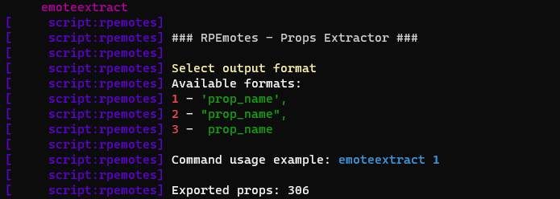

# <div align="center">RPEmotes 🏋️</div>

## This is the OFFICIAL repository of RPEmotes.

### RPEmotes is under GNU GPL v3 licensing.

### If you fork or include any content from this menu into your own, all credits must remain including credits to myself and Dullpear, and the content must remain __**OPEN SOURCE**__. 

### You must not escrow ANY of the content included in this menu including but not limited to code, props and animations.

If this bullshit behaviour continues, I will make the repository private yet again. Fuck the FiveM money hungry community.

-------------------------------

RPEmotes <b><i>was</b></i> a community driven FiveM emote menu allowing players to express themselves in roleplay with custom animations, countless facial expressions, walkstyles and props, inspired by [DullPear](https://github.com/andristum/dpemotes). 

Unfortunately, as FiveM fails to enforce their own ToS and many individuals have bullied me out of the community, it is no longer being maintained. 

  - It is also extremely shameful that despite the repository being licensed under GPL V3, many scumbags within the community can essentionally steal and reupload its' content to their shady Tebex stores, of which the Tebex support team simply turn a blind eye to as it makes them, Rockstar, and the Cfx.re team money.

I simply don't care about getting inspiration or if you want to make a new UI as you don't find NativeUI appealing; that's fine, but to outright steal animations and props from the community of which have been gracefully provided to RPEmotes under the conditions that I, TayMcKenzieNZ do not finanically profit of it, only for you others to reupload behind a paywall, is for lack of a better word, "Completely and utterly fucked up".

Too often I am seeing exact copies and nothing is unique. Oh look, your menu has an option to disable the idle camera; Did I invent that? No. Was I the first to implement it into an animation menu? Yeah. Can I stop anyone else from doing so? No. But at least be unique, at least add something to your menu that makes someone say "DUDE! I've been wanting this forever but this other person doesn't have it. Damn! Thanks man!" Rather than just a blantant copy paste with a new UI.

As I am no longer actively updating this repository and resource, please troubleshoot it yourself and stay away from <b>unofficial</b> copies that refuse to acknowledge the hardwork of those who contributed to the original resource.


---------------------------------------------------------------------------------------------------------

<p align="center">
    
</p>


<p align="center">
    
    <a href="https://github.com/TayMcKenzieNZ/rpemotes/stargazers"></a>
    <a href="https://github.com/TayMcKenzieNZ/rpemotes/network/members"></a>
    <a href="https://github.com/TayMcKenzieNZ/rpemotes/graphs/contributors"></a>
</p>

---------------------------------------------------------------------------------------------------------

# Available in 🌏

* Albanian 🇦🇱

* Brazilian Portuguese 🇧🇷

* Chinese Simplified 🇨🇳

* Chinese Traditional 🇨🇳

* Czech 🇨🇿

* Danish 🇩🇰

* Dutch 🇳🇱

* English 🇬🇧

* Finnish 🇫🇮

* French 🇫🇷

* German 🇩🇪

* Greek 🇬🇷

* Hungarian 🇭🇺

* Indonesian 🇮🇩

* Italian 🇮🇹

* Japanese 🇯🇵

* Lithuanian 🇱🇹

* Norwegian 🇳🇴

* Persian 🇮🇷

* Polish 🇵🇱

* Romanian 🇷🇴

* Russian 🇷🇺

* Serbian 🇷🇸

* Sinhala 🇱🇰

* Slovenian 🇸🇮 

* Spanish 🇪🇸

* Swedish 🇸🇪

* Turkish 🇹🇷

* Vietnamese 🇻🇳

All languages were translated or contributed by you, our amazing community with the odd exception of using Google Translate.

Languages can be selected and / or added in the config.lua.

---------------------------------------------------------------------------------------------------------

# Features 🛠️

 - Changeable Banner Font

 - Changable Banner Colour

- Multiple Translations 🌏

- Search Function 🔎

- Custom Animations with **permission from the community** 🏃

- Persistent Facial Expressions via client KVP 🤪

- Animal Emotes 🐩

- Shared Dances 🕺💃

- Persistent Walkstyles via client KVP 🚶‍♂️ - Standalone, QB-Core and ESX support!

- Persistent Disabling Of Idle Camera via KVP 🎥

- Crouching 🐞

- Crawling 🐛

- Finger Pointing 👆

- Ragdoll 😵

- Hands up 🙌

- Shared Particle Effects 💨

- QB-Core Framework & SQL Keybinding Support ⚙️

- Further support for shared and couple poses / animations 👫

- Easily convert Menyoo to RPEmotes 🔄

- Hide Adult Emotes 🔞

- Hide Animal Emotes ⛔

- Easy To Understand Configuration File ⚙️

- Exit Emotes 😎

- Working Binoculars 👀

- News Camera 🎤📹

- Props Extractor for anti-cheat scripts 💾

---------------------------------------------------------------------------------------------------------

# Exports 

When using our emote menu with other scripts, using the `TriggerEvent('animations:client:EmoteCommandStart` won't do anything because the events do not exist. These have simply been replaced with the following exports:

```lua
exports["rpemotes"]:EmoteCommandStart(emoteName, textureVariation)
exports["rpemotes"]:EmoteCancel(forceCancel) – forceCancel is optional
exports["rpemotes"]:CanCancelEmote(state)
exports["rpemotes"]:IsPlayerCrouched()
exports["rpemotes"]:IsPlayerProne()
exports["rpemotes"]:IsPlayerCrawling()
exports["rpemotes"]:IsPlayerPointing()
exports["rpemotes"]:IsPlayerInAnim()
exports["rpemotes"]:IsPlayerInHandsUp()
exports["rpemotes"]:toggleWalkstyle(bool, message) -- bool to allow the user to change their walkstyle in the menu or not / message to show the user (optional, default is :"You are unable to change your walking style right now.")"
exports["rpemotes"]:toggleBinoculars()
exports["rpemotes"]:toggleNewscam()
```

---------------------------------------------------------------------------------------------------------

# Menu Keybind 🎛️

The keybind uses RegisterKeyMapping. By default the configured keybind in the *initial* config.lua will be the default key, however once the keybind is set for a user it'll remain and can be changed in the users settings under `Esc > settings > keybinds > fivem`.


**Menu key:**

|COMMAND: | ACTION:|
|---|---|
| F4 | Open / Close  RPEmotes menu |

Server owners can change this in the `config.lua`.

Alternatively, the player base can set their own menu keybind to open RPEmotes

`Esc > settings > keybinds > fivem`

* More keybinds are now using key mappings which means that they are now available in your FiveM settings to change (`FavKeybind` and `RagdollKeybind`)

---------------------------------------------------------------------------------------------------------

# Keybinds and SQL 🎛️

To use the SQL features, install the latest version of the [oxmysql](https://github.com/overextended/oxmysql) resource and enable the setting in `config.lua`

```lua
SqlKeybinding = false,
```

If you do not want to use the SQL features keep the `oxmysql` region in fxmanifest.lua commented out.

Alternatively, you can use the keybind command that comes with FiveM without having to use SQL, by entering the following into F8:

`bind keyboard "Yourbutton" "e youremote"`. To remove the keybind, type `"unbind keyboard "Yourbutton"`.

---------------------------------------------------------------------------------------------------------

# Menu Customization

In the appropiately named `config.lua` file, server owners can set the MenuTitle or simply leave it blank. Ideally, this should be 11 characters or less without any spaces.
You can also set the font, whether or not you want an outline and the MenuPosition. The available fonts are as followed:

```lua
    -- 0 : Chalet London
    -- 1 : House Script
    -- 2 : Monospace
    -- 4 : Chalet Comprime Cologne
    -- 7 : Pricedown
```

RPEmotes also supports custom banners (known as 'MenuImage') which can be defined by a simple imgur, giphy or discord URL like so:

```lua
MenuImage = 'https://i.imgur.com/osq2J0h.png',
```

You can find a banner template here - https://imgur.com/a/jRrVBog. Banners must be 512 x 128 pixels and can be either gif or png.


---------------------------------------------------------------------------------------------------------

# Increments 

Pressing 'LEFT ALT' on the keyboard allows players to scroll through the menu one by one, or by 10.

Alternatively, players can use the `SHARE` button on an Xbox controller or `OPTIONS` button on a Playstation controller.

---------------------------------------------------------------------------------------------------------

# Ragdoll 🥴

* To enable ragdoll, change `RagdollEnabled = false,` to true in config.lua.

Much like the menu key, `RagdollKeybind` is also using RegisterKeyMapping. It is currently set to `U` by default *(server side)* however can be set to the player's preferred keybind in the FiveM keybinds setting found in the settings menu within the Esc Menu.

* New setting: `RagdollAsToggle`, this will make either the ragdoll be a toggle or a hold key

---------------------------------------------------------------------------------------------------------

# Finger Pointing & Hands Up 👆

Once enabled, players can press `B` on the keyboard to enable standalone finger pointing, and `Y` to put their hands up, without the need for unnecessary frameworks or "small resources".

Much like everything else in the menu, server owners can change these keybinds to their own preferences.

|COMMAND: | ACTION:|
|---|---|
| B | Toggle Finger Pointing |
| Y | Toggle Hands Up |
| /pointing | Toggle Finger Pointing |
| /handsup | Toggle Hands Up |

---------------------------------------------------------------------------------------------------------

# Crouching & Crawling

**Crouching:**

RIGHT CONTROL. Players can move forward, back, left and right as well as turning around. Press SPACEBAR to switch from stomach to back. Pressing RIGHT CONTROL key while running will have the player "dive into" a crouching animation.

**Crawling:**

Server owners can opt in to either overriding the stealth / action animation when pressing the LEFT CONTROL keybind or have players tap LEFT CONTROL twice to switch from stealth to crouch (when enabled in the config.lua file)

# Chat Commands

|COMMAND: | ACTION:|
|---|---|
| LEFT CONTROL | Toggle Crouching On / Off |
| RIGHT CONTROL | Toggle Crawling On / Off |
| /crouch | Toggle Crouching On / Off |
| /crawl| Toggle Crawling On / Off |

---------------------------------------------------------------------------------------------------------

# Moods & Walkstyles 😜🚶‍♂️

Moods and walkstyles can be set from the menu. These will save to your character and reapply when exiting a vehicle, or loading back into the server as they are saved via client side KVP.

|COMMAND: | ACTION:|
|---|---|
| F4 | Opens RPEmotes menu |
| /walks | See A List Of Walkstyles In Chat |
| /moods | See A List Of Walkstyles In Chat |
| /reset mood | Remove preferred mood and set default |
| /reset walk | Remove last walkstyle and set default |

---------------------------------------------------------------------------------------------------------

# No Idle Cam 📷

No Idle Cam allows players to disable the idle camera animation on foot and in vehicle, making RP scenarios, streaming on Twitch, or just general gameplay just a little more enjoyable.

|COMMAND: | ACTION:|
|---|---|
| /Idlecamon | deactivates the native|
| /idlecamoff | enables the native|


---------------------------------------------------------------------------------------------------------

# Binoculars 👀

|COMMAND: | ACTION:|
|---|---|
| /binoculars | starts the binoculars|
| L ALT | Toggle between night, heat and normal visions |
| G | Show or hide the instructions |
| BACKSPACE | Exit the binoculars |


 

---------------------------------------------------------------------------------------------------------

# News Camera 

|COMMAND: | ACTION:|
|---|---|
| /newscam | starts the News Camera |
| H |  Edit Text |
| L ALT | Toggle between vision modes |
| G | Show or hide the instructions |
| BACKSPACE | Exit News Camera |


 


---------------------------------------------------------------------------------------------------------

# Favorite Emote

Players can search for an emote (so long as search is enabled) and press LEFT SHIFT and CAPLOCKS on their keyboard to add it to their 'Favorites'. Pressing CAPLOCKS will toggle the emote.

Alternatively, you can use the 🌟 Favorite menu to find an emote and press enter.

--------------------------------------------------------------------------------

# Exit Emotes

Exit Emotes are used to make cancelling an animation more smoother and dynamic, such as getting up off a chair or throwing a cigarette out instead of dropping it.

You can add your own Exit Emotes under `AnimationListCustom.lua`'s new `CustomDP.Exits = {}` array.

---------------------------------------------------------------------------------------------------------

# Adult Emotes 🔞

Adult Emotes can be hidden from the menu by setting `AdultEmotesDisabled` to `true` in the config.lua file.

This will completely conceal the emotes from the lists *(Emotes, Shared Emotes, etc)* at startup making them unusable. Alternatively, you can also hide animal emotes.

----------------------------------------------------------------------

# Prop Extractor ↔️

Many people have expressed concerns over anticheat scripts kicking or banning their community members due to the fact RPEmotes uses props and anticheats detecting said props being spawned.

To make server owners' jobs a little easier, we have added a prop extractor command that you can enter into the server console which will automate a file inside the RPEmotes resource folder appropriately named, `prop_list.lua`.

### Command:

`emoteextract`

```lua

Available output formats:
1 - 'prop_name',
2 - "prop_name",
3 - prop_name

Command usage example: emoteextract 1
```

if you would like to visually see the props that are present in RPEmotes *(minus custom made and provided content)*, you can see them [here](https://forge.plebmasters.de/account?tab=datalists&datalist=1abf505b-23b3-493a-31a2-08dbd7a05cc3&type=Object) thanks to [DurtyFree](https://github.com/DurtyFree) and the Plebmaster's team ☺️.



----------------------------------------------------------------------


# Screenshots 📸

| | | |
|-|-|-|
|  |  |  |
|  |  |  |
|  |  |  |
|  |  | |
|  |  | |

------------------------------------------------------------------------------------------

# Installation Instructions ⚙️:

* Add `ensure rpemotes` to your `server.cfg`

* Download the latest recommended artifacts [for Windows](https://runtime.fivem.net/artifacts/fivem/build_server_windows/master/) or [for Linux](https://runtime.fivem.net/artifacts/fivem/build_proot_linux/master/)

* [Enforce gamebuild to latest build](https://forum.cfx.re/t/tutorial-forcing-gamebuild-to-casino-cayo-perico-or-tuners-update/4784977) for all emotes and props to work as intended.

**Onesync Infinity is required for the particle effects to work as intended** This can be done via txadmin or your localhost .bat file.**

For localhost servers, comment out onesync from your server.cfg and add the following to your `.bat` file:

```lua

+set onesync on +set onesync_enableInfinity 1 +set onesync_enableBeyond 1 +set onesync_population true

```

You can put this before your gamebuild enforcement, aka `+set sv_enforceGameBuild XXXX`

* Set the desired language and settings in the config.lua under `MenuLanguage = 'en',`

* Qb-Core server owners, set `Framework = 'qb-core'` in the config file, otherwise leave it as false.

* To use the SQL features, install the [oxmysql](https://github.com/overextended/oxmysql) resource then open `keybinds.lua` in RPEmotes. If you do not want to use the SQL features, comment out the `oxmysql` region in fxmanifest.lua.

Alternatively, you can use the keybind command that comes with FiveM without having the SQL, by entering the following into F8:

`bind keyboard "Yourbutton" "e youremote"`. To remove the keybind, type `"unbind keyboard "Yourbutton"`.

* Type `/refresh` and `/start rpemotes` into your chat resource, or simply restart your server

# Additional Instructions ⚙️

- **Check out my youtube playlist below:**

[](https://youtube.com/playlist?list=PLzFM1zdDHFn2vKWT323wVJoEkGhWiyyeC)

A text tutorial for Shared Emotes can be found [here](https://forum.cfx.re/t/how-to-menyoo-to-rpemotes-emote-props-shared-emotes-conversions/4775018). 

I recommend using the updated and supported version of [Menyoo](https://github.com/itsjustcurtis/MenyooSP/releases) by ItsJustCurtis as it already supports FiveM, taking away rhe manual frustration of updating the ASI file, which I previously mentioned in the forum post before Cfx.re banned me out of spite.


------------------------------------------------------------------------------------------------------------------------------------------------------

# 📜 LICENSE & DISCLAIMER

## Aligned with Rockstar Games' [acquisition](https://www.rockstargames.com/newswire/article/8971o8789584a4/roleplay-community-update?utm_source=twitter&utm_medium=o_social&utm_campaign=rockstar_announcement_cfxre-20230811) of Cfxre and FiveM, RPEmotes will abstain from including copyrighted material and animations tailored for child characters, as outlined in bulletpoint 4 of the [November 2023 community pulse](https://forum.cfx.re/t/community-pulse-november-2023/5185781).

This repository was created by **TayMcKenzieNZ** for strict usage with the Grand Theft Auto 5 unofficial multiplayer platform 'FiveM', and is under the GNU General Public License v3.0 license.

All custom props and animations were provided to RPEmotes **by the community** with **express permission** and must **not** be extracted from [RpEmotes](https://github.com/TayMcKenzieNZ/rpemotes), reuploaded to any websites, forums or discord servers without permission **and** credits given.

----------------------------------------------------------------------------------------------------------------------------------------------------------------------------------------------------------------------------

# Credits 🤝

**All** custom animations and props were added with permissions from the creators and does **not** contain any paid or leaked work.

All animation creators have ***specifically*** asked that their content remains free and that the RPEmotes team and community do not try to profit from them, claim them as their own or reupload them anywhere else but TayMcKenzieNZ's GitHub unless express permission has been arranged and granted by their respective creators, therefore you may not extract the animations and props or use them for your own menus unless written permission has been granted to you by the creators.


A huge thank you to the following people for their amazing contributions made to the menu 🫶🏻 :

- A huge thank you to [Kibook](https://github.com/kibook) for the addition of the Animal Emotes sub menu

- Thank you to [AvaN0x](https://github.com/AvaN0x) for reformatting and assisting with code, additional features and figuring out shared particle effects

- Thank you to [Mads](https://github.com/MadsLeander) for joining the team as Co-Developer 

- Thank you to [Mathu_lmn](https://github.com/Mathu-lmn) for joining the team as Co-Developer 

- Thank you to [Tigerle](https://forum.cfx.re/u/tigerle_studios) for providing the additional code required to make Shared Emotes work to it's full extent

- Thank you to [SMGMissy](https://forum.cfx.re/u/smgmissy/) for assisting with custom pride flags and how to stream them

- Thank you to [MissSnowie](https://www.gta5-mods.com/users/MissySnowie) for the Explicit Usage Rights Agreement to add free custom animations either publicly available or on their discord and for the motivational and overal moral support

- Thank you to [GeekGarage](https://github.com/geekgarage) for their knowledge, time and dedication, helping to bring new and exciting features to the menu

- Thank you to [Smokey](https://www.gta5-mods.com/users/struggleville) for the Explicit Usage Rights Agreement to add free custom animations either publicly available on on their discord

- Thank you to [BzZzi](https://forum.cfx.re/u/bzzzi/summary) for the Explicit Usage Rights Agreement to add free donut, croissant and fire torch props

- Thank you to [Natty3d](https://forum.cfx.re/u/natty3d/summary) for the Explicit Usage Rights Agreement to add free lollipop props

- Thank you to [northsqrd](https://github.com/0sqrd) for adding the search function, Animal Emotes config, mobile phone prop texture variants and general contributions

- Thank you to crusopaul and Eki for discussing KVP and initializing it to the menu for persistent walkstyles

- Thank you to [Amnilka](https://www.gta5-mods.com/users/frabi) for the Explicit Usage Rights Agreement to add free custom animations either publicly available or on their discord

- Thank you to [LittleSpoon](https://discord.gg/safeword) for the Explicit Usage Rights Agreement to add free custom animations either publicly available or on their discord

- Thank you to [Pupppy](https://discord.gg/rsN35X4s4N) for the Explicit Usage Rights Agreement to add free custom animations either publicly available or on their discord

- Thank you to [SapphireMods](https://discord.gg/Hf8F4nTyzt) for the Explicit Usage Rights Agreement to add free custom animations either publicly available or on their discord

- Thank you to [QueenSisters Animations](https://discord.gg/qbPtGwQuep) for the Explicit Usage Rights Agreement to add free custom animations either publicly available or on their discord

- Thank you to [Kri's Graphic House](https://discord.gg/JueRG3fCy6) for the custom banners

- Thank you to !MWooM#0597 on discord for the custom banners

- Thank you to [BoringNeptune](https://www.gta5-mods.com/users/BoringNeptune) for the custom dance emotes

- Thank you to [CMG Mods](https://www.gta5-mods.com/users/-moses-) for the custom emotes

- Thank you to [prue颜](discord.gg/lunyxmods) for being a great friend and providing us with exclusive custom animations

- Thank you to [PataMods](https://forum.cfx.re/u/Pata_PataMods) for the custom props

- Thank you to [Crowded1337](https://www.gta5-mods.com/users/crowded1337) for the custom Gucci bag. I have removed the Gucci logo to comply with Rockstar Games & TakeTwo Interactive

- Thanks to [EnchantedBrownie](https://www.gta5-mods.com/users/EnchantedBrownie) for the custom animations

- Thanks to [Copofiscool](https://forum.cfx.re/u/copofiscool/) for adding a toggle to the Favorite Keybinds

- Thank you to [iSentrie](https://forum.cfx.re/u/isentrie/) for additional code, support and joining the RPEmotes project 

- Thank you to Chocoholic Animations for the custom animations

- Thank you to [CrunchyCat](https://www.gta5-mods.com/users/crunchycat) for the custom animations

- Thank you [KayKayMods](https://discord.gg/5bYQVWVaxG) for the custom props

- Thank you to [MonkeyWhisper](https://github.com/MonkeyWhisper) and [Project Sloth](https://github.com/Project-Sloth) for the custom props

- Thank you to [Brummieee](https://forum.cfx.re/u/brummieee_maps/summary) for the custom props

- Thank you [Dark Animations](https://www.gta5-mods.com/users/Darks%20Animations) for the partnership and custom animations. You the goat 😎

- Thank you [Chico](https://forum.cfx.re/u/chico) for implementing natives to reapply persistent moods and walkstyles for ESX and QB-Core frameworks

- Thank you [-EcLiPsE-](https://www.gta5-mods.com/users/-EcLiPsE-) for allowing me to implement [Improved Prop Sets](https://www.gta5-mods.com/misc/improved-propsets-meta) and [GTA Online Biker Idle Anims](https://www.gta5-mods.com/misc/bike-idle-animations)

- Thank you [MrWitt](https://www.gta5-mods.com/users/MrWitt)for the custom animations and partnership

- A huge thank you to [AdoredRose](https://forum.cfx.re/u/adoredrose/summary) for assisting with animations

- Thank you [Vedere](https://discord.gg/XMywAMQ8Ef) for the custom props

- Thank you to [DRX Animations](https://www.gta5-mods.com/users/DRX%2DAnimations) for the custom animations and partnership

- Thank you to [VNSIanims](https://discord.gg/cTNrjYSXXG) for the custom animations and partnership

- Thank you to [PNWParksFan](https://www.gta5-mods.com/users/PNWParksFan) for the custom props

- Thank you to [AlbertThePrince](https://github.com/alberttheprince). While we may have our differences, you have fixed some underlying issues with the menu which have bothered me for many years. I just wish things didn't end up this way and that people could have contributed meaningful pull requests, however, I guess with everything being open source, so long as credit is visible, there isn't an issue. *(I have also credited you in the menu with a 'popcorn' hex colour.)*

- Thank you to you, the community for providing translations and supporting the project throughtout the years.

You paid a huge role in making this script what it is today and we could not do it without you 🙏

-------------------------------------------------------------------------------

# REMINDER

This is the <b>OFFICIAL</b> repository for RPEmotes, is no longer being maintained and has <b>NO</b> association with Linden, or Scullyy. While our menus may appear visibly similar or contain similar content, all content was contributed by the community.

We appreciate everything you have contributed and hope that you enjoy the menu 🙏.
