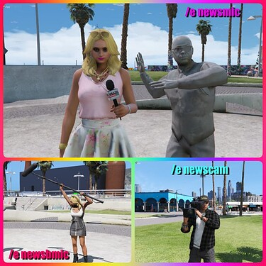
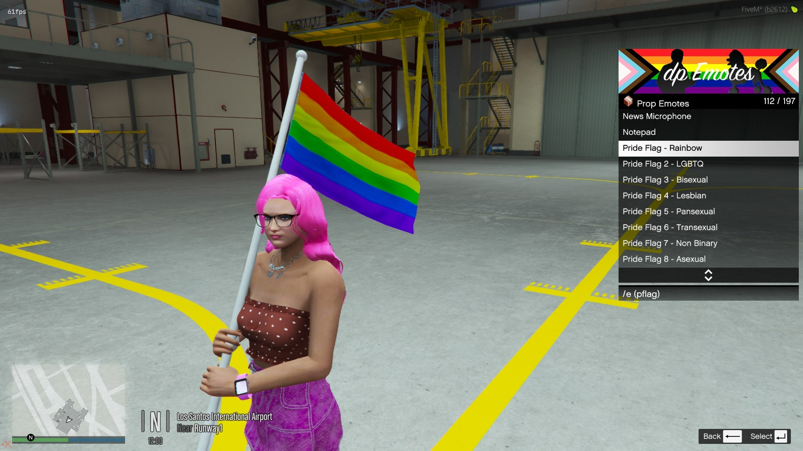
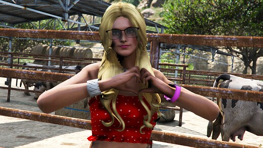
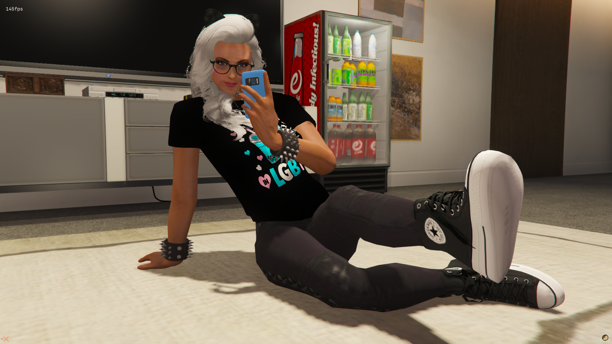
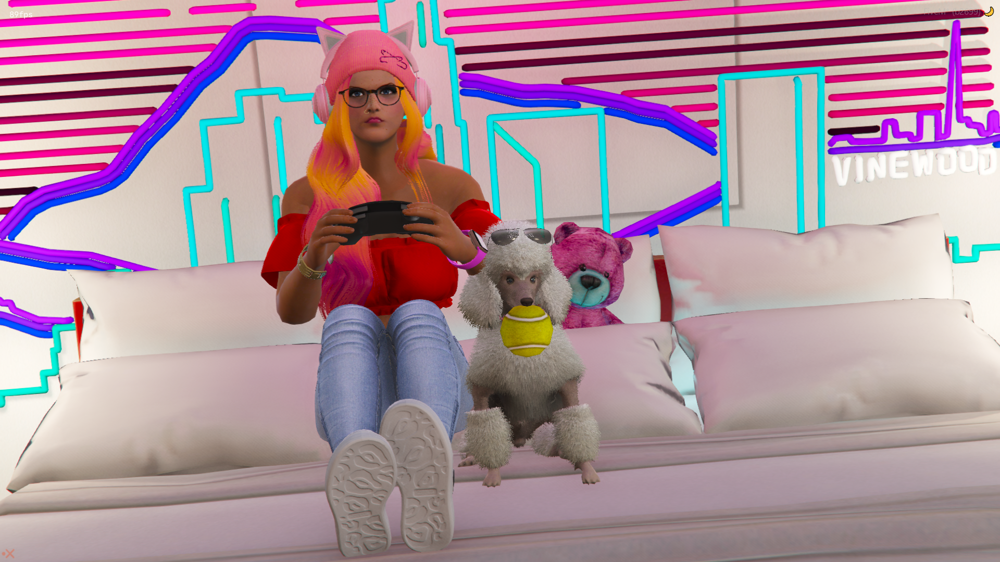
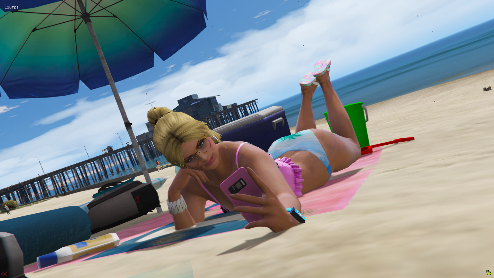
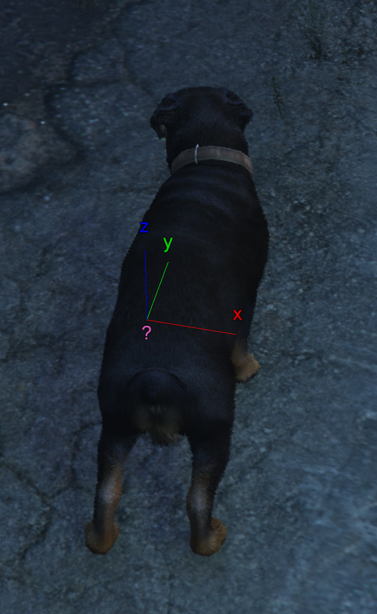
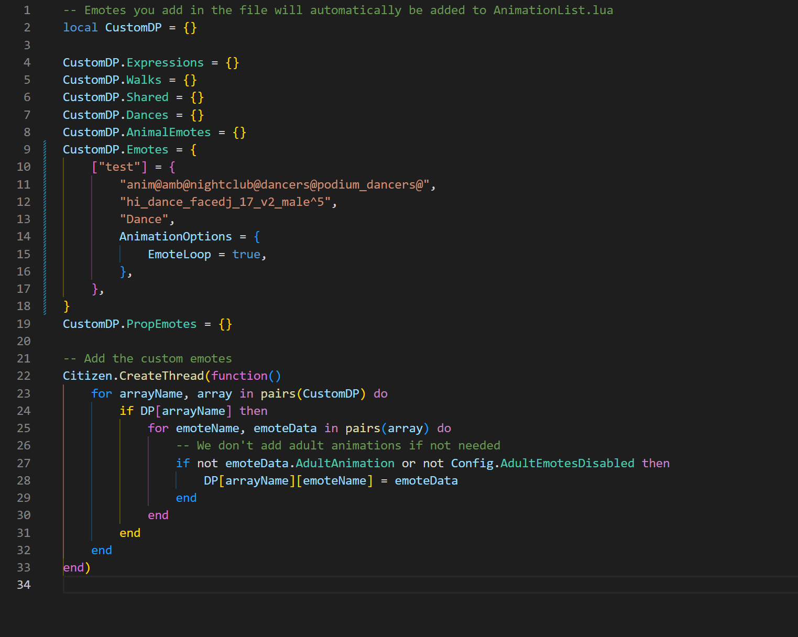

# RpEmotes 🏋️

RpEmotes is a community driven FiveM emote menu allowing players to express themselves in roleplay with custom animations, countless facial expressions, walkstyles and props, inspired by [DullPear](https://github.com/andristum/dpemotes).


# **Join Our Official Discord 💬**

<a href="https://discord.gg/sw3NwDq6C8" target="blank"></a>

- Report Issues ⚠️

- Report Bugs 🪲

- Contribute Code 🛠️

- Contribute Translations 🌎

- Chat With Our Amazing Community 🗨️

----------------------------------------------------------------------------------------------------------------------------------------------------------------------------------------------------------------------------------------------------------------------------------------------------------------------------------------------

# Available in 🌏

* Brazilian Portuguese 🇧🇷

* Czech 🇨🇿

* Danish 🇩🇰

* Dutch 🇳🇱

* English 🇬🇧

* Finnish 🇫🇮

* French 🇫🇷

* German 🇩🇪

* Hungarian 🇭🇺

* Italian 🇮🇹

* Norwegian 🇳🇴

* Persian 🇮🇷

* Polish 🇵🇱

* Romanian 🇷🇴

* Russian 🇷🇺

* Spanish 🇪🇸

* Swedish 🇸🇪

* Turkish 🇹🇷

All languages were translated or contributed by you, the community with the odd exception of using Google Translate.

If you happen to find any incorrect translations or would like to add more languages, please feel free to make a pull request with the correct / additional translations or join our discord.

Languages can be selected and / or added in the config.lua.

----------------------------------------------------------------------------------------------------------------------------------------------------------------------------------------------------------------------------------------------------------------------------------------------------------------------------------------------

# Features 🛠️

- Multiple Translations 🌏

- Search Function 🔎

- Custom Animations with **permission from the community** 🏃

- Facial Expressions 🤪

- Animal Emotes 🐩

- Shared Dances 🕺💃

- Persistent Walkstyles via client KVP 🚶‍♂️

- Shared Particle Effects 💨

- QB-Core Framework & SQL Keybinding Support ⚙️

- Further support for shared and couple poses / animations 👫

- Easily convert Menyoo to RPEmotes 🔄

- Hide Adult Emotes 🔞

- Hide Animal Emotes ⛔

- Easy To Understand Configuration File ⚙️

- Exit Emotes 😎

- Standalone exports

----------------------------------------------------------------------------------------------------------------------------------------------------------------------------------------------------------------------------------------------------------------------------------------------------------------------------------------------

# Exports

```lua
exports["rpemotes"]:EmoteCommandStart(emoteName, textureVariation)
exports["rpemotes"]:EmoteCancel(forceCancel) – forceCancel is optional
exports["rpemotes"]:CanCancelEmote(state)
exports["rpemotes"]:IsPlayerCrouched()
exports["rpemotes"]:IsPlayerProne()
exports["rpemotes"]:IsPlayerCrawling()
exports["rpemotes"]:IsPlayerPointing()
```

----------------------------------------------------------------------------------------------------------------------------------------------------------------------------------------------------------------------------------------------------------------------------------------------------------------------------------------------

# Menu Keybind 🎛️

The keybind uses RegisterKeyMapping. By default the configured keybind in the *initial* config.lua will be the default key, however once the keybind is set for a user it'll remain and can be changed in the users settings under `Esc > settings > keybinds > fivem`.


**Menu key:** F4

Server owners can change this in the `config.lua`.

Alternatively, the player base can set their own menu keybind to open RpEmotes

`Esc > settings > keybinds > fivem`

* More keybinds are now using key mappings which means that they are now available in your FiveM settings to change (`FavKeybind` and `RagdollKeybind`)

----------------------------------------------------------------------------------------------------------------------------------------------------------------------------------------------------------------------------------------------------------------------------------------------------------------------------------------------

# Keybinds and SQL 🎛️

To use the SQL features, install the latest version of the [oxmysql](https://github.com/overextended/oxmysql) resource and enable the setting in `config.lua`

```lua
SqlKeybinding = false,
```

If you do not want to use the SQL features keep the `oxmysql` region in fxmanifest.lua commented out.

Alternatively, you can use the keybind command that comes with FiveM without having to use SQL, by entering the following into F8: 

`bind keyboard "Yourbutton" "e youremote"`. To remove the keybind, type `"unbind keyboard "Yourbutton"`.

----------------------------------------------------------------------------------------------------------------------------------------------------------------------------------------------------------------------------------------------------------------------------------------------------------------------------------------------

# Ragdoll 🥴

* To enable ragdoll, change `RagdollEnabled = false,` to true in config.lua.

Much like the menu key, `RagdollKeybind` is also using RegisterKeyMapping. It is currently set to `U` by default *(server side)* however can be set to the player's preferred keybind in the FiveM keybinds setting found in the settings menu within the Esc Menu.

* New setting: `RagdollAsToggle`, this will make either the ragdoll be a toggle or a hold key

----------------------------------------------------------------------------------------------------------------------------------------------------------------------------------------------------------------------------------------------------------------------------------------------------------------------------------------------

# Finger Pointing & Hands Up 👆

Once enabled, players can press `B` on the keyboard to enable standalone finger pointing, and `H` to put their hands up, without the need for unnecessary frameworks or "small resources".

Much like everything else in the menu, server owners can change these keybinds to their own preferences.

----------------------------------------------------------------------------------------------------------------------------------------------------------------------------------------------------------------------------------------------------------------------------------------------------------------------------------------------

# Crouching & Crawling

**Crawling:**

Server owners can opt in to either overriding the stealth/action animation when pressing the LEFT CONTROL keybind or have players tap LEFT CONTROL twice to switch from stealth to crouch (when enabled in the config.lua file)


**Crouching:** 

RIGHT CONTROL. Players can move forward, back, left and right as well as turning around. Press SPACEBAR to switch from stomach to back. Pressing RIGHT CONTROL key while running will have the player "dive into" a crouching animation.

# Chat Commands

/crouch

/crawl

----------------------------------------------------------------------------------------------------------------------------------------------------------------------------------------------------------------------------------------------------------------------------------------------------------------------------------------------

# Favorite Emote

Players can search for an emote (so long as search is enabled) and press LEFT SHIFT and CAPLOCKS on their keyboard to add it to their 'Favorites'. Pressing CAPLOCKS will toggle the emote.

Alternatively, you can use the 🌟 Favorite menu to find an emote and press enter.

----------------------------------------------------------------------------------------------------------------------------------------------------------------------------------------------------------------------------------------------------------------------------------------------------------------------------------------------

# Exit Emotes

Exit Emotes are used to make cancelling an animation more smoother and dynamic, such as getting up off a chair or throwing a cigarette out instead of dropping it.

You can add your own Exit Emotes under `AnimationListCustom.lua`'s new `CustomDP.Exits = {}` array. 

Below is an example of how this would look:

```lua
    },
    ["sit"] = {
        "anim@amb@business@bgen@bgen_no_work@",
        "sit_phone_phoneputdown_idle_nowork",
        "Sit",
        AnimationOptions = {
            EmoteLoop = true,
            ExitEmote = "getup",
            ExitEmoteType = "Exits"
        }
    },
```

The ExitEmote calls for the 'getup' emote, which is noted as the following:

```lua
["getup"] = {
        "get_up@sat_on_floor@to_stand",
        "getup_0",
        "Get Up",
        AnimationOptions = {
            EmoteDuration = 2000
        }
    }
}
```

----------------------------------------------------------------------------------------------------------------------------------------------------------------------------------------------------------------------------------------------------------------------------------------------------------------------------------------------

# Adult Emotes 🔞

Adult Emotes can be hidden from the menu by setting `AdultEmotesDisabled` to `true` in the config.lua file.

This will completely conceal the emotes from the lists *(Emotes, Shared Emotes, etc)* at startup making them unusable.

The emotes that are concealed, are the ones flagged in the animation list with `AdultAnimation`. You can see how it is done with `fspose`.

Alternatively, you can also hide animal emotes.

----------------------------------------------------------------------------------------------------------------------------------------------------------------------------------------------------------------------------------------------------------------------------------------------------------------------------------------------

# QB-Core ⚙️

**QBCore integration to match their fork of dpemotes**

- Config option which supports the QB Framework in their fork of the original dpemotes.

If you’re using qb-core, you can now set

```lua
Framework = "qb-core",
```

in the config file, otherwise leave it as

```lua
Framework = false,
```

*You may need to alter some code within qbcore to work with RPEmotes.*

----------------------------------------------------------------------------------------------------------------------------------------------------------------------------------------------------------------------------------------------------------------------------------------------------------------------------------------------

# Screenshots 📸

| | | |
|-|-|-|
|  |  |  |
|  |  |  |
|  |  |  |
|  |  | |
|  |  | |

----------------------------------------------------------------------------------------------------------------------------------------------------------------------------------------------------------------------------------------------------------------------------------------------------------------------------------------------

# Installation Instructions ⚙️:

* Add `ensure rpemotes` to your `server.cfg`

* Download the latest recommended artifacts [for Windows](https://runtime.fivem.net/artifacts/fivem/build_server_windows/master/) or [for Linux](https://runtime.fivem.net/artifacts/fivem/build_proot_linux/master/)

* [Enforce gamebuild to latest build](https://forum.cfx.re/t/tutorial-forcing-gamebuild-to-casino-cayo-perico-or-tuners-update/4784977) for all emotes and props to work as intended.

**Onesync Infinity is required for the particle effects to work as intended** This can be done via txadmin or your localhost .bat file.**

For localhost servers, comment out onesync from your server.cfg and add the following to your `.bat` file:

```lua

+set onesync on +set onesync_enableInfinity 1 +set onesync_enableBeyond 1 +set onesync_population true

```

You can put this before your gamebuild enforcement, aka `+set sv_enforceGameBuild XXXX`

* Set the desired language and settings in the config.lua under `MenuLanguage = 'en',` 

* Qb-Core server owners, set `Framework = 'qb-core'` in the config file, otherwise leave it as false.

* To use the SQL features, install the [oxmysql](https://github.com/overextended/oxmysql) resource then open `keybinds.lua` in RPEmotes. If you do not want to use the SQL features, comment out the `oxmysql` region in fxmanifest.lua.

Alternatively, you can use the keybind command that comes with FiveM without having the SQL, by entering the following into F8: 

`bind keyboard "Yourbutton" "e youremote"`. To remove the keybind, type `"unbind keyboard "Yourbutton"`.

* Type `/refresh` and `/start rpemotes` into your chat resource, or simply restart your server

# Additional Instructions ⚙️

- **Check out my youtube playlist below:**

[](https://www.youtube.com/watch?v=3uVe0hvWwPQ&list=PLzFM1zdDHFn2vKWT323wVJoEkGhWiyyeC)

----------------------------------------------------------------------------------------------------------------------------------------------------------------------------------------------------------------------------------------------------------------------------------------------------------------------------------------------

# Shared emotes 👩🏻‍❤️‍💋‍👨🏼

Emotes will work with either `SyncOffset` or `Attachto`.

- If it is with `SyncOffsetFront` or `SyncOffsetSide`, then the offset used is the one of the emote the player started.<br/>
For example, if player one starts the emote `handshake` which has `SyncOffsetFront`, then player one will have the `SyncOffsetFront` but not the other player.


- If it is with `Attachto`, then it'll either be player one's data used for attaching, or the player two's data.<br/>
For example, if player one start the emote carry, then the other player will be attached but not the player one because Attachto is set in `carry2` and not `carry`.<br/>
- If player one starts the emote `carry2`, then player one will be attached and not the other player.
it's the player who start the animation who will in most cases be moved


*Special case, if both emote have the `Attachto` then only the player who started the emote will be attached.*

You can find a list of ped bones to attach the other player here: [Ped Bones](https://wiki.rage.mp/index.php?title=Bones) or alternatively if the link is down for some reason, you can check [here](https://wiki.rage.mp/index.php?title=Bones)

Using the websites provided above, enter the bone ID, ie `1356` and not `111`, which is the Bone Index.

Understandably, this can be confusing for some people. We suggest using the `Attachto` approach.

----------------------------------------------------------------------------------------------------------------------------------------------------------------------------------------------------------------------------------------------------------------------------------------------------------------------------------------------

# Particle Effects 💨

**REQUIRES ONESYNC INFINITY**

Particle effects can be found using the [DurtyFree GTA V Dump](https://github.com/DurtyFree/gta-v-data-dumps/blob/master/particleEffectsCompact.json). You will need to add the particle assest, name, and placement. Placement is done via XYZ, Pitch, Roll, Yaw, and scale.

Onesync is required for them to work across all clients.

Big thanks to DurtyFree for his amazing work.


```lua
PtfxPlacement = {
    -0.15, -- X
    -0.35, -- Y
     0.0, -- Z
     0.0, -- ROTATION X
     90.0, -- ROTATION Y
     180.0, -- ROTATION Z
       1.0 -- SCALE
},
```



By default, the main prop will share it's coordinates with the particle effect, so just put 0.0 for the particle effects and you will be good to go.

If no prop is used in the animation or you require the particle effect to be in a different location, use `PtfxNoProp = true`, and 0.0 will 9/10 times be the human peds' stomach; you can then offset your coordinates based on that with the first 3 entries being XYZ, and the last 3 being rotation XYZ.

Alternatively, you can use the `PtfxBone =` AnimationOption to attach the PTFX to the ped's bone, simiarly to how you attach props.

Using Menyoo, spawn down a tennis ball and attach it to human, by default menyoo will attach it to the SKEL_ROOT bone (stomach), so from that, what we can do is is either offset the coordinates, say, up to the human ped's mouth, or change the bone all together. Once we've got it correct, we can transfer those coordinates over to rpemotes, and tah dah, we have our Ptfx Placement.

----------------------------------------------------------------------------------------------------------------------------------------------------------------------------------------------------------------------------------------------------------------------------------------------------------------------------------------------

# Adding Your Own Animations ⚙️

Because the menu gets updated frequently, the files get overwritten. To avoid this, you can add your own / downloaded animation files `(.ycd)` inside of a newly created folder, give it a name, and place it in the `rpemotes\stream\[Custom Emotes]` folder.

Add your animation code to the `AnimationListCustom.lua` and make a backup of this file, call it `BackUpAnimationListCustom.lua`.

Whenever an update is released, rename `BackUpAnimationListCustom.lua` to `AnimationListCustom.lua`, click yes to overwrite, and you're good to go. 

It is also a good idea to keep a backup of your config file.
Below is an example:



----------------------------------------------------------------------------------------------------------------------------------------------------------------------------------------------------------------------------------------------------------------------------------------------------------------------------------------------

# Add-Ons 🛠️

* Fixed an issue with the clipboard and added textures to paper (/e clipboard)

* Changed umbrella texture to black (/e umbrella)

----------------------------------------------------------------------------------------------------------------------------------------------------------------------------------------------------------------------------------------------------------------------------------------------------------------------------------------------
# Police Badge 👮

- Custom LSPD police badge by [LSPDFR member Sam](https://www.lcpdfr.com/downloads/gta5mods/misc/23386-lspd-police-badge/)

- LSPD reskinned badge by [GTA5Mods user Sladus_Slawonkus](https://www.gta5-mods.com/misc/lspd-police-badge-replace-sladus_slawonkus)

----------------------------------------------------------------------------------------------------------------------------------------------------------------------------------------------------------------------------------------------------------------------------------------------------------------------------------------------

# 📜 LICENSE & DISCLAIMER

This project is under the GPL V3 license, however all custom props and animations were provided to RPEmotes by the community with express permission and must not be extracted from [RpEmotes](https://github.com/TayMcKenzieNZ/rpemotes), reuploaded to any websites, forums or discord servers.

If you want to modify RpEmotes ***(does not apply if you want to use it for personal purposes)*** or make an agreement, you can contact TayMcKenzieNZ via Discord. Pull requests are actively reviewed and discussed with TayMcKenzieNZ and contributors, and will be accepted as long as they do not contain  animation / prop files *(we need permission before adding them)* breaking changes or suspicious code.


✅ You are allowed to use the custom animations explicitly provided within this repository only 

✅ You are allowed to add your own custom animations to this resource and use it on your server. The entire content must remain on your server and not be reuploaded.

❌ You are not allowed to re-distribute the custom animations provided with this repository either on websites, forums, tebex store or discord. 

❌ You are not allowed to claim the custom animations provided within this resource as your own work

----------------------------------------------------------------------------------------------------------------------------------------------------------------------------------------------------------------------------------------------------------------------------------------------------------------------------------------------

# Credits 🤝

**All** custom animations and props were added with permissions from the creators and does **not** contain any paid or leaked work.

All animation creators have ***specifically*** asked that their content remains free and that the RPEmotes team and community do not try to profit from them, claim them as their own or reupload them anywhere else but TayMcKenzieNZ's GitHub unless express permission has been arranged and granted by their respective creators, therefore you may not extract the animations and / or use them for your own menus. 


A huge thank  you to the following people for their amazing contributions made to the menu 🫶🏻 : 

- Thank you to [Tigerle](https://forum.cfx.re/u/tigerle_studios) for providing the additional code required to make Shared Emotes work to it's full extent

- Thank you to [SMGMissy](https://forum.cfx.re/u/smgmissy/) for assisting with custom pride flags and how to stream them

- Thank you to [MissSnowie](https://www.gta5-mods.com/users/MissySnowie) for the Explicit Usage Rights Agreement to add free custom animations either publicly available or on their discord and for the motivational and overal moral support 

- A huge thank you to [Kibook](https://github.com/kibook) for the addition of the Animal Emotes sub menu

- Thank you to [AvaN0x](https://github.com/AvaN0x) for reformatting and assisting with code, additional features and figuring out shared particle effects

- Thank you to [Scullyy](https://github.com/Scullyy) for reformatting and assisting with code, rebranding of RPEmotes, providing a much more cleaner version checker, and firework RGB research

- Thank you to [GeekGarage](https://github.com/geekgarage) for their knowledge, time and dedication, helping to bring new and exciting features to the menu

- Thank you to [Smokey](https://www.gta5-mods.com/users/struggleville) for the Explicit Usage Rights Agreement to add free custom animations either publicly available on on their discord

- Thank you to [BzZzi](https://forum.cfx.re/u/bzzzi/summary) for the Explicit Usage Rights Agreement to add free donut, croissant and fire torch props

- Thank you to [Natty3d](https://forum.cfx.re/u/natty3d/summary) for the Explicit Usage Rights Agreement to add free lollipop props

- Thank you to [northsqrd](https://github.com/0sqrd) for adding the search function, Animal Emotes config, mobile phone prop texture variants and general contributions

- Thank you to crusopaul and Eki for discussing KVP and initializing it to the menu for persistent walkstyles 

- Thank you to [Amnilka](https://www.gta5-mods.com/users/frabi) for the Explicit Usage Rights Agreement to add free custom animations either publicly available or on their discord

- Thank you to [LittleSpoon](https://discord.gg/safeword) for the Explicit Usage Rights Agreement to add free custom animations either publicly available or on their discord

- Thank you to [Pupppy](https://discord.gg/rsN35X4s4N) for the Explicit Usage Rights Agreement to add free custom animations either publicly available or on their discord

- Thank you to [SapphireMods](https://discord.gg/Hf8F4nTyzt) for the Explicit Usage Rights Agreement to add free custom animations either publicly available or on their discord

- Thank you to [QueenSisters Animations](https://discord.gg/qbPtGwQuep) for the Explicit Usage Rights Agreement to add free custom animations either publicly available or on their discord

- Thank you to [Kri's Graphic House](https://discord.gg/JueRG3fCy6) for the custom banners

- Thank you to [BoringNeptune](https://www.gta5-mods.com/users/BoringNeptune) for the custom dance emotes

- Thank you to [CMG Mods](https://www.gta5-mods.com/users/-moses-) for the custom emotes

- Thank you to [prue颜](discord.gg/lunyxmods) for being a great friend and providing us with custom animations

- Thank you to [PataMods](https://forum.cfx.re/u/Pata_PataMods) for the custom Christmas props

- Thank you to [Crowded1337](https://www.gta5-mods.com/users/crowded1337) for the custom Gucci bag. I have removed the Gucci logo to comply with Rockstar Games & TakeTwo Interactive

- Thanks to [EnchantedBrownie](https://www.gta5-mods.com/users/EnchantedBrownie) for the custom animations

- Thanks to [Copofiscool](https://forum.cfx.re/u/copofiscool/) for adding a toggle to the Favorite Keybinds

- Thank you to [Mads](https://github.com/MadsLeander) for contributing to the menu and adding Exit Emotes

- Thank you to [iSentrie](https://forum.cfx.re/u/isentrie/) for additional code and support

- Thank you to Chocoholic Animations for the custom animations

- Thank you to you, the community for being patient, showing love and appreciation, and for providing translations.

You pay a big role in making this script what it is today and we could not do it without you 🙏

-------------------------------------------------------------------------------
